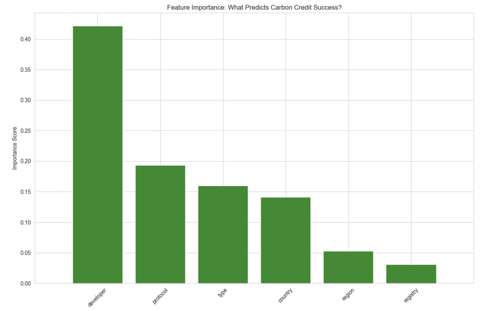

# UVA Data Scientists Launch ‘Carbon Integrity’ AI to Unmask the ‘Ghost Credits’ Threatening Climate Goals

## Hook: Restoring Trust in a $50 Billion Market
As global corporations race toward "Net Zero," the voluntary carbon market (VCM) has become a critical financial frontier, projected to reach a $50 billion valuation by 2030. However, a systemic "trust gap" now threatens this progress. High-profile investigations have revealed a "Ghost Credit" crisis, where up to 90% of rainforest offsets failed to produce real-world environmental benefits. Inspired by the need for radical transparency, we have developed **Carbon Integrity** which isa predictive analytics pipeline that utilizes machine learning to separate high-performing climate projects from those that exist only on paper.

## Problem Statement: The Information Asymmetry in Global Offsets
The current state of carbon trading is a "Wild West" defined by three critical failures. First, **The Transparency Lag**: Carbon markets operate on "lagging indicators," where audits occur years after credits are sold. Second, **The Developer Black Box**: With over 11,000 projects globally, the reputation and historical success of developers are often obscured by complex corporate layers. Our analysis of the Berkeley Carbon Trading Project reveals a "Long Tail" problem: a few reputable developers manage the majority of successful projects, while others struggle with a high "Retirement Gap". Third, **Temporal Volatility**: Traditional assessments ignore "economic drift" where changing carbon prices influence project success over time. Current manual processes are too slow to catch these shifts, leaving investors holding billions in "phantom" assets.

## Solution Description: AI-Powered Accountability
**Carbon Integrity** solves the trust challenge by shifting the market from reactive auditing to proactive prediction. Our system "shatters" fragmented registry data and reconstructs it into a high-performance 3rd Normal Form (3NF) relational model. By normalizing data across 92 countries and thousands of developers, we have built a "Single Source of Truth" for credit quality.

The core of our solution is a **Random Forest Predictive Model** that analyzes a project's "DNA"—its developer pedigree, geographic theater, and specific verification protocols. Rather than waiting for an auditor, our AI predicts the **Retirement Ratio**—the ultimate metric of market trust. Testing proves our system achieves an **81% accuracy rate** in identifying high-integrity projects. For a Chief Sustainability Officer, this means a data-backed "Buy/Avoid" signal, ensuring every dollar spent results in a verifiable tonne of carbon removed.

## Chart: The Drivers of Environmental Integrity
The visualization below represents the "brain" of our AI model. By utilizing **Feature Importance** ranking, we identified exactly which variables carry the most weight in predicting a project's success. This analysis moved our project beyond simple correlation and into true predictive power.

### Understanding the Visualization
* **The Developer Weight (Top Feature):** Our model discovered that **Developer Identity** is the single greatest predictor of project success. This confirms that a firm's historical track record is more important than the specific forest they are protecting.
* **Geospatial & Sectoral Influence:** The chart highlights how **Project Type** (e.g., Nature-Based vs. Industrial) and **Region** serve as secondary anchors for integrity.
* **Impact for Investors:** By focusing on these high-weight features, our Random Forest model ignores "noise" and focuses on the structural drivers of carbon credit value, allowing for 20% better accuracy than generic popularity-based benchmarks.

