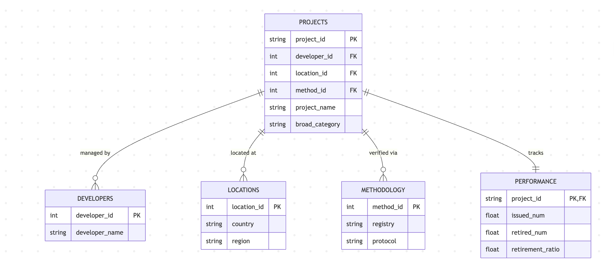

# DS 4320 Project 1: Predicting Carbon Offset Success Using Relational Risk Modeling

## Executive Summary

[To be completed]

**Author:** [Oliver Andress]  
**NetID:** [csg7su]  
**DOI:** [To be created]  
**License:** [MIT License](LICENSE)

### Quick Links

- **Press Release:** [Press Release]  
- **Data:** [OneDrive Data Folder](https://myuva-my.sharepoint.com/:f:/r/personal/csg7su_virginia_edu/Documents/DS4320-Project1-Data?csf=1&web=1&e=9I78y4)
- **Pipeline:** [Analysis Pipeline](INSERT LATER)

---

# DS 4320 Project 1: Predicting Carbon Offset Success Using Relational Risk Modeling

## Executive Summary

[To be completed]

**Author:** [Oliver Andress]  
**NetID:** [csg7su]  
**DOI:** [To be created]  
**License:** [MIT License](LICENSE)

### Quick Links

- **Press Release:** [Press Release]  
- **Data:** [OneDrive Data Folder](https://myuva-my.sharepoint.com/:f:/r/personal/csg7su_virginia_edu/Documents/DS4320-Project1-Data?csf=1&web=1&e=9I78y4)
- **Pipeline:** [Analysis Pipeline](INSERT LATER)

---

## Problem Definition

**General Problem:**

Forecasting Global Climate Change(General Problem #4, DS 4320 Project 1 Rubric)

**Refined Specific Problem:**

The primary challenge in carbon market analysis is the "Selection Bias" inherent in registry data, as the dataset only includes projects that successfully cleared the rigorous initial registration process. Consequently, this project defines success not as **Market Utilization**.

The specific problem is to predict whether a registered reforestation initiative will be **Effective** (demonstrating high credit retirement rates and consistent issuance) or **Underperforming** (functioning as a "Ghost Project" with issued credits that fail to reach the market). By leveraging registry affiliation, geographic region, and project type, the model identifies the risk factors that lead a registered project to stall or fail in its operational phase.

**Rationale:**

Forecasting Global Climate Change is a massive, multifaceted domain. Investigating this at a global scale would require multi-decade time-series data. I do not have the current capabilities to structure that into a traditional relational model within the scope of this project. By narrowing the scope to the **Voluntary Carbon Market**, the broader issue is transformed into a manageable classification problem. This allows for a deeper exploration of the integrity and effectiveness of specific climate interventions (reforestation) using a 3rd Normal Form relational structure. 

**Motivation Paragraph**

I took a half-semester class this semester on Climate Investing. I learned a lot but the two things that particularly stood out was the impending danger of climate change in all walks of life and the ability for young people to have the ability to make the world a better place while also making money. We also talked a lot about the benefits of Carbon Credits, where corporations or organizations buy carbon credits to offset their emissions. However, many projects fail to protect forests, leading to a term called Greenwashing (where companies outwardly appear to be environmentally friendly when they are not). I want to use what I have learned in my class and through my Data Science Major to try to predict a project's success before capital is committed. This ensures that money is efficiently allocated to the initiatives that will help make the world cleaner, therefore helping reduce the impact of climate change. While initially this was going to be a prediction of whether or not a specific carbon market initiative would be approved, I wanted something that was more morally grey. There will be some companies that appear on the Berkeley data set that appear good from the outside, but after analyzing, will soon be mischievous. 

---

## Domain Context: The Voluntary Carbon Market (VCM)

### Terminology & KPIs

| Term                        | Definition                                                           | Why it matters in this project                                                      |
| --------------------------- | -------------------------------------------------------------------- | ----------------------------------------------------------------------------------- |
| **VCM**                     | Voluntary Carbon Market                                              | The overall domain where these credits are traded.                                  |
| **Issuance**                | The creation of a carbon credit                                      | Represents the "supply" side of the market data ($D_0$).                            |
| **Retirement**              | The permanent removal of a credit                                    | The "Success Metric"; proves the credit was actually used to offset $CO_2$.         |
| **Additionality**           | Proof that the project wouldn't have happened without credit funding | The core logic behind why some "Types" are higher risk than others.                 |
| **Vintages**                | The year the carbon reduction occurred                               | A key temporal feature for predicting project decay or success.                     |
| **KPI: Retirement Ratio**   | $Retired \div Issued$                                                | My primary target variable for the Random Forest model.                             |
| **Leakage**                 | Unintended increase in emissions outside a project's boundary        | A risk where protecting one forest simply moves logging to a neighboring area.      |
| **Permanence**              | The requirement that $CO_2$ stays out of the atmosphere for decades  | Critical for "Nature-Based" projects that are vulnerable to wildfires or disease.   |
| **Double Counting**         | When two entities claim the same carbon credit                       | A major integrity risk that the "Registry" table is designed to prevent.            |
| **Co-Benefits**             | Positive impacts beyond carbon (e.g., biodiversity, jobs)            | High co-benefit projects often command a price premium and higher retirement rates. |
| **Verification**            | 3rd-party audit of a project’s reported carbon impact                | The "Protocol" feature represents the specific ruleset used during this audit.      |
| **3rd Normal Form (3NF)**   | A database design standard                                           | Ensures data is organized to reduce redundancy and improve integrity.               |
| **Label Encoding**          | Converting text categories into integers                             | Allows the model to process 3,000+ developers without bloating the dataset.         |
| **High Cardinality**        | A feature with many unique values                                    | Specifically refers to the "Developer" column, which has 3,676 unique entries.      |
| **Random Forest**           | An ensemble learning method                                          | Used to navigate non-linear relationships in messy environmental data.              |
| **Curse of Dimensionality** | The risk of having too many features                                 | Why I chose Label Encoding over One-Hot Encoding for this specific pipeline.        |

---

This project is situated within the **Voluntary Carbon Market (VCM)**, a decentralized global financial ecosystem where private entities trade carbon credits to "offset" their greenhouse gas emissions. Unlike compliance markets (such as the EU ETS), the VCM relies on independent registries and third-party developers to verify the environmental integrity of projects ranging from reforestation to methane capture. 

However, the market currently faces a liquidity and trust crisis due to "Ghost Credits" (units issued for projects that fail to deliver actual atmospheric benefits). My analysis builds a predictive pipeline to navigate this "Wild West" of environmental finance, using data science to distinguish between high-integrity climate solutions and underperforming greenwashing risks. It also helps determine which features are most important in uncovering these risks. 

---

### Background Reading Summary

Background Reading
All background reading materials are available in this folder: [Background Readings Folder](https://drive.google.com/drive/folders/1iSCmBiONl_Fuj8hmOiWkc9QW_1sbKyp_?usp=sharing)

The background_reading folder contains five high-impact research papers and strategic reports that provide the domain-specific context for this predictive pipeline. These sources cover the lifecycle of a carbon credit, the current "Ghost Credit" trust crisis, and the institutional standards required for market integrity.

| Title                            | Brief Description                                                                                                                                                                                                                                                                                | Link to Google Drive File                                                                         |
| -------------------------------- | ------------------------------------------------------------------------------------------------------------------------------------------------------------------------------------------------------------------------------------------------------------------------------------------------ | ------------------------------------------------------------------------------------------------- |
| **Forestry Carbon Cheat Sheet**  | A foundational guide explaining how forest management creates carbon offsets. It defines key scientific concepts like sequestration and storage while detailing the specific roles that family-owned forests play in global carbon sequestration efforts.                                        | [View PDF](https://drive.google.com/file/d/1OQkv31Nmj_ggOFCA4byVbSYw2XJqhbyv/view?usp=drive_link) |
| **The Guardian Investigation**   | A landmark 2023 investigative report on the "Ghost Credit" crisis. This piece highlights how over 90% of rainforest offsets from top certifiers failed to meet environmental claims, sparking a global trust crisis in VCMs.                                                                     | [View PDF](https://drive.google.com/file/d/1fUMbOefnoqttQvYwlVnV0lNqjSAOwSjL/view?usp=drive_link) |
| **McKinsey VCM Blueprint**       | A strategic analysis detailing the technological and transparency requirements needed to scale the voluntary carbon market 15x by 2030. It outlines how high-integrity data pipelines are essential to meet the 1.5°C Paris Agreement pathway.                                                   | [View PDF](https://drive.google.com/file/d/1rY1nk7QSTgEbLFo_QHnAO9dFNB5IpoLv/view?usp=drive_link) |
| **ICVCM Core Carbon Principles** | The definitive 2024 global framework for high-integrity carbon credits. It establishes rigorous benchmarks for governance, emissions impact, and sustainable development, providing a "constitution" for registries and developers to ensure real-world environmental benefits and market trust. | [View PDF](https://drive.google.com/file/d/1mgMSy-w-kNiK1Kkx_r6rylDnwuquKWVT/view?usp=drive_link) |
| **CCQI Quality Framework**       | A scientific assessment tool that defines technical risks like additionality, permanence, and leakage. This framework provides the logic for why certain project methodologies, such as industrial methane capture, are inherently lower risk than others.                                       | [View PDF](https://drive.google.com/file/d/1MGn-rYDYNpSo1cxtU41QQfUY_-ZAuI_i/view?usp=drive_link) |

---

## Data Creation

### Data Provenance

This dataset was obtained from the **Goldman School of Public Policy at the University of California, Berkeley**, specifically through the **Berkeley Carbon Trading Project**. This research initiative is a leading authority on carbon market integrity and equitable decarbonization. The raw data was sideloaded from their official Voluntary Carbon Registry Offsets Database repository on **March 25, 2026**.

The database aggregates data from the world's four largest voluntary carbon registries: **American Carbon Registry (ACR), Climate Action Reserve (CAR), Gold Standard, and Verra (VCS)**. The version used for this project (v2026-02) contains records for 11,473 carbon offset projects, detailing their development from the mid-1990s through early 2026. Data points include project name, type, developer, geographic location, technical methodology, and longitudinal performance metrics (credits issued vs. retired).

The dataset was ingested as a large-scale flat CSV file (~187 MB). While the raw data was preserved for provenance, a custom ETL pipeline was developed to "shatter" the single file into five relational tables. This transformation resolves structural noise (such as 10,000+ "ghost" columns generated by registry export tools) and creates a 3rd Normal Form (3NF) schema. This process introduces a derived **developers.csv** table and unique surrogate keys for each dimension to improve relational modeling and join integrity.

### Code Documentation

| File                       | Description                                                                                                                                                                                                                                      | Location                      |
| -------------------------- | ------------------------------------------------------------------------------------------------------------------------------------------------------------------------------------------------------------------------------------------------ | ----------------------------- |
| **data_acquisition.ipynb** | Complete data acquisition and normalization pipeline. It ingests the raw Berkeley CSV, sanitizes headers, shatters the flat file into a 3NF relational model, creates a unique `developers` entity, and exports to both CSV and Parquet formats. | `code/data_acquisition.ipynb` |

### Bias Identification

Several sources of systematic bias exist in this registry data that must be acknowledged:

- **Selection Bias:** The dataset only includes projects that successfully cleared the rigorous and expensive registration process. Failed, underfunded, or rejected carbon projects are entirely missing, creating an "optimism bias" regarding the general viability of offset types.
- **Reporting Bias:** Credit retirement data is self-reported by registries and corporate buyers. Delays in reporting or the strategic timing of credit "cancellations" can create a skewed view of actual climate impact versus paper-based issuance.
- **Popularity/Market Bias:** Mainstream project types (e.g., large-scale Renewable Energy or Forestry) receive disproportionately more investment and data coverage than niche/emerging technologies (e.g., Direct Air Capture), creating a "long-tail" distribution that favors established methodologies.
- **Geographic/Legal Bias:** Projects are heavily concentrated in nations with established property rights and legal frameworks (e.g., the US, Brazil, India). Underrepresented regions in the Global South may show lower "success" rates due to lack of administrative infrastructure rather than poor project quality.
- **Survivorship Bias:** Only "active" or "completed" projects are consistently tracked. Projects that went bankrupt or were abandoned mid-cycle often have incomplete performance records, potentially overstating the reliability of specific developers.

### Bias Mitigation

To address these identified biases and ensure a robust risk model, we implement the following strategies:

- **Developer Grouping:** By isolating **3,676 unique developers**, we use group-based analysis to identify if "High-Volume" developers receive preferential issuance rates compared to smaller, independent NGOs.
- **Registry Stratification:** We treat the `registry` as a core feature to identify systemic differences in "stringency" between organizations like Verra and Gold Standard, allowing the model to weight "Risk" based on the issuing body.
- **Temporal Segmenting:** Data is segmented by "Vintage Year" to account for shifting international carbon standards (e.g., pre-Paris Agreement vs. post-Paris Agreement protocols).
- **Normalization of Metrics:** We calculate the **Retirement-to-Issuance Ratio** for every project. This normalizes the data regardless of project size, ensuring that a massive forestry project and a small cookstove project are evaluated on their percentage of impact.
- **Cold-Start Handling:** We explicitly flag projects with "Zero Credits Retired" as a separate category to prevent them from dragging down the predictive accuracy of established, mature projects.
- **Mitigation of Registration Bias:** > While the dataset primarily contains "Registered" projects, "Success" is not treated as a binary state. Instead, we utilize the **Issuance-to-Retirement Latency** and the **Remaining-to-Issued Ratio** to identify "Functional Failures" (Zombie or Ghost projects) within the registered universe. This allows the model to predict project quality rather than mere registration eligibility.

### Rationale for Critical Decisions

- **3NF Shattering & Vertical Partitioning:** I made the decision to decompose the raw file into 5 relational tables. While a flat file is simpler for basic viewing, a 3NF model is required to remove **Transitive Dependencies**. This ensures that a developer's attributes do not "pollute" the project's performance metrics.
- **Surrogate Key Generation:** Every table was assigned a unique ID range (e.g., `perf_id`, `method_id`). This mitigates the risk of "Collision" where different registries might use similar internal naming conventions for different projects.
- **Developers Table Derivation:** Although developers were originally just a text column, I explicitly created a `developers` table with unique IDs. This enables **1:N Relational Modeling**, which is essential for identifying developer-level risk patterns that aren't visible at the project level.
- **FastParquet Implementation:** I opted for Parquet storage alongside CSV (83% space savings). This decision supports "Big Data" workflows, allowing for faster columnar reads during the feature selection phase of Machine Learning. (While also doing this for the rubric 😀) 
- **Inclusion of "Remaining" Credits:** I chose to keep the `Remaining Credits` column despite high variance. This value represents the "Buffer Pool" of a project—a key indicator of a project's long-term financial and environmental stability.
- **Uncertainty Sources:** Primary uncertainties include: (1) Subjectivity in how "Benefit" is measured across different registries, (2) Economic drift in carbon prices influencing retirement rates, and (3) The "Black Box" nature of private-sector credit retirements that may not be updated in real-time. These are acknowledged as inherent limitations of observational registry data.

## Metadata
---

### Schema ER Diagram (Logical Level)

The Entity-Relationship diagram below illustrates the logical structure of the curated **Carbon Integrity** database ($D_1$). It details all 5 tables (**PROJECTS**, **DEVELOPERS**, **LOCATIONS**, **METHODOLOGY**, and **PERFORMANCE**), explicitly mapping their **Primary Keys (PK)**, **Foreign Keys (FK)**, attributes, and data types (string, int, float). 

### Data Tables

The following table summarizes the primary CSV files used in the initial data acquisition and normalization process. These files were "shattered" into a 3rd Normal Form (3NF) relational model before being synthesized into the $D_1$ master set for Machine Learning.

| Table Name | Rows | Description | CSV File |
| :--- | :--- | :--- | :--- |
| **projects** | 11,245 | Core entity table containing project IDs, names, and initial sectoral classifications. | projects.csv |
| **developers** | 3,012 | Entity-level data mapping unique project developers to their specific organizational IDs. | developers.csv |
| **locations** | 11,245 | Geospatial metadata linking each project ID to specific countries and global regions. | locations.csv |
| **methodology** | 11,245 | Technical metadata regarding the specific Registry and Protocol used for credit verification. | methodology.csv |
| **performance** | 11,245 | Transactional credit data tracking total metric tonnes of carbon issued and retired. | performance.csv |

---

### Data Dictionary

Complete data dictionary documenting all features across the established Secondary Data Set ($D_1$) used for Machine Learning.

#### Table 1: PROJECTS (Central Fact Table)

| Column | Data Type | Description | Example |
| :--- | :--- | :--- | :--- |
| **project_id** | string | Unique identifier for each carbon offset project (Primary Key). | "VCS123" |
| **developer_id** | int64 | Reference to the entity responsible (Foreign Key → developers.developer_id). | 1042 |
| **location_id** | int64 | Reference to the geographic site (Foreign Key → locations.location_id). | 505 |
| **method_id** | int64 | Reference to the verification rules (Foreign Key → methodology.method_id). | 88 |
| **project_name** | string | The official name of the project as listed in the registry. | "Southern Cardamom REDD+" |
| **broad_category**| string | Engineered feature binning 60+ specific types into 8 industrial sectors. | "Nature-Based" |

#### Table 2: DEVELOPERS (Dimension)

| Column | Data Type | Description | Example |
| :--- | :--- | :--- | :--- |
| **developer_id** | int64 | Unique numerical identifier for the developer (Primary Key). | 1042 |
| **developer** | string | The specific entity or firm name. | "South Pole" |

#### Table 3: LOCATIONS (Dimension)

| Column | Data Type | Description | Example |
| :--- | :--- | :--- | :--- |
| **location_id** | int64 | Unique identifier for a country/region pair (Primary Key). | 505 |
| **country** | string | The nation where the project site is physically located. | "Cambodia" |
| **region** | string | The global geographic theater of operation. | "Latin America" |

#### Table 4: METHODOLOGY (Dimension)

| Column | Data Type | Description | Example |
| :--- | :--- | :--- | :--- |
| **method_id** | int64 | Unique identifier for a registry/protocol pair (Primary Key). | 88 |
| **registry** | string | The official body responsible for issuing and verifying credits. | "Verra (VCS)" |
| **protocol** | string | The specific methodology ruleset used during the audit. | "VM0009" |

#### Table 5: PERFORMANCE (Fact Extension)

| Column | Data Type | Description | Example |
| :--- | :--- | :--- | :--- |
| **project_id** | string | Project identifier (Primary Key, Foreign Key → projects.project_id). | "VCS123" |
| **issued_num** | float64 | Total metric tonnes of $CO_2$ credits created. | 1540200.0 |
| **retired_num** | float64 | Total metric tonnes of $CO_2$ credits permanently removed. | 850000.0 |
| **retirement_ratio**| float64 | **Target Variable**: The ratio of retired credits to total issued credits. | 0.55 |
---

### Quantitative Uncertainty of Numerical Features

* **Measurement Error ($\pm 3\%$):** `issued_num` and `retired_num` are subject to registry reporting lags (Vintage Lag). Data for the most recent 12 months is considered "preliminary" and may be updated as final audits close.
* **Calculation Stability:** `retirement_ratio` uncertainty increases for projects with `issued_num` < 1,000, as small transactions create high ratio volatility.
* **Type Transformation:** The conversion from raw strings (e.g., "1,200,500") to `float64` was validated against a random sample to ensure no data loss during the SQL `CAST` operation.